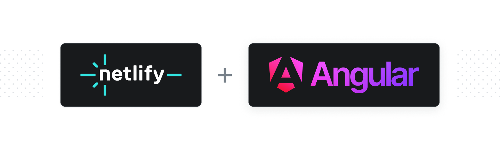

# Essential Angular Universal Plugin

This build plugin is a utility for supporting Angular Universal on Netlify.

## Table of Contents

- [Installation and Configuration](#installation-and-configuration)
- [CLI Usage](#cli-usage)
- [Caveats](#caveats)
- [Getting Help](#getting-help)
- [Contributing](#contributing)
- [License](#license)

## Installation and Configuration

### Manual Installation

Create a `netlify.toml` in the root of your project. Your file should include the plugins section below:

```toml
[build]
  command = "ng build --configuration production && ng run {projectName}:serverless:production"
  publish = "dist/{projectName}/browser"

[[plugins]]
  package = "@netlify/plugin-angular-serverless"
```

If you'd like to install this plugin at a fixed version, install it via your package manager:

```bash
npm install -D @netlify/plugin-angular-universal
# or
yarn add -D @netlify/plugin-angular-universal
```

Read more about [file-based plugin installation](https://docs.netlify.com/configure-builds/build-plugins/#file-based-installation)
in our docs.

## CLI Usage

### Requirements

To use the Essential Angular Universal plugin while building and deploying with the CLI, you need to have `netlify-cli v5.4.13` installed (or a later version).

Please also make sure to use `ntl deploy --build --prod` (rather than `ntl build`).

### Plugin Side Effects

When this plugin is run as part of the build process using the Netlify CLI, direct changes will be made to your project source:

1. It will modify your angular.json to add a `serverless` project configuration.
2. It will add `serverless.ts` and `tsconfig.serverless.json` files.

It is up to you whether to commit these changes to your project. If the plugin makes updates to these files or configurations, it will overwrite what you'd previously committed, and you can commit the new updates. Otherwise, you can stash and ignore them.

### Workflow

If you'd like to build and deploy your project using the
[Netlify CLI](https://docs.netlify.com/cli/get-started/), we recommend this
workflow to manage git tracking plugin-generated files:

1. Make sure all your project's files are committed before running a build with
   the CLI
2. Run any number of builds and deploys freely (i.e. `netlify build`,
   `netlify deploy --build`, `netlify deploy --prod`)
3. Run `git stash --include-unstaged` to easily ignore plugin-generated files

It's important to note that the CLI may mix your project's source code and
plugin-generated files; this is why we recommend committing all project source
files before running CLI builds.

## Caveats

This plugin is currently in beta.

Right now:
- it does not include out of the box monorepo support
- it does not support Angular Universal prerendering

## Getting Help

We love to hear from you so if you have questions, comments or find a bug in the
project, let us know! You can either:

- Open an issue on this repository
- Tweet at us! We're [@Netlify on Twitter](https://twitter.com/Netlify)
- Or, [join the community forums](https://answers.netlify.com)

## Contributing

We welcome contributions ❤️ - see the [CONTRIBUTING.md](docs/CONTRIBUTING.md) file
for details.

## License

This project is licensed under the MIT License - see the
[LICENSE.md](LICENSE.md) file for details
